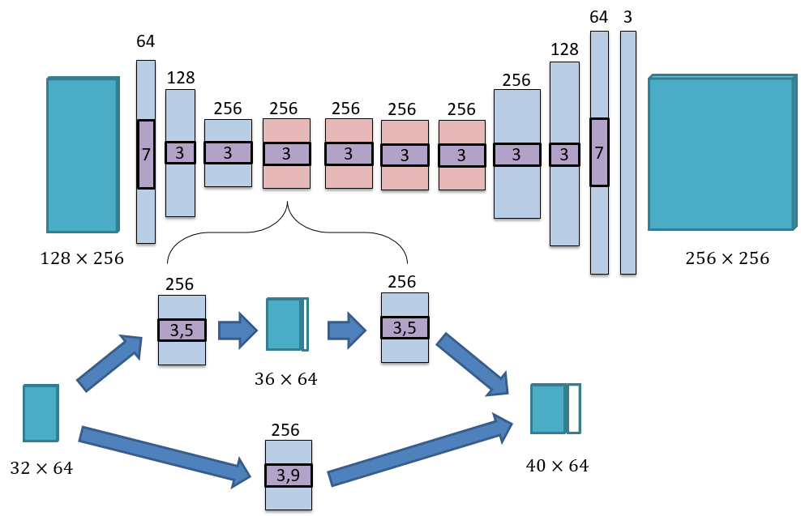

# A experiment code for one dimensional expansion
 


This code was mainly adapted by [kaixi Xie](https://github.com/ckxy) on the basis of the repository [non-stationary_texture_syn](https://github.com/jessemelpolio/non-stationary_texture_syn).

### Requirements

This code is tested under Ubuntu 14.04 and 16.04. The total project can be well functioned under the following environment: 

* python-2.7 
* pytorch-0.3.0 with cuda correctly specified
* cuda-8.0
* other packages under python-2.7

### Preparations

Please run `download_pretrained_models.sh` first to make a new folder `Models` and then download the VGG19 model pre-trained on ImageNet to this folder. The pre-trained VGG19 model is used to calculate style loss.

### Data

There is no restriction for the format of the source texture images. The structure of the data folder is recommanded as the provided sub-folders inside `datasets` folder. To be more specific, `datasets/half` is what we use in paper production.

The dataset structure is recommended as:
```
+--half
|
|   +--sunflower
|
|       +--train
|
|           +--sunflower.jpg
|
|       +--test
|
|           +--sunflower.jpg
|
|   +--brick
|
|       +--train
|
|           +--brick.jpg
|
|       +--test
|
|           +--brick.jpg
|
...
```

### Architecture of the repository

Inside the main folder, `train.py` is used to train a model as described in our paper. `test.py` is used to test with the original image(result is 2x the size of the input). `test_recurrent.py` is used for extreme expansions. `cnn-vis.py` is used to visualize the internal layers of our generator. The residual blocks visualization shown in our paper are generated through `cnn-vis.py`.

In folder `data`, file `custom_dataset_data_loader` specified five dataset mode: `aligned`, `unaligned`, `single` and `half_crop`. Generally, we use `single` for testing and `half_crop` for training. 

In folder `models`, two files are of great importance: `models.py` and `networks.py`, please carefully check it before using it. `half_gan_style.py` is the major model we use in our paper. Some utilities are implemented in `vgg.py`.

In folder `options`, all hyperparameters are defined here. Go to this folder to see the meaning of every hyperparameter.

Folder `scripts` contains scripts used for training and testing. To train or test a model, use commands like `sh scripts/train_half_style.sh`. Go into these files to see how to specify some hyper parameters.

Folder `util` contains some scripts to generate perlin noise (perlin2d.py), generate random tile (random_tile.py), which are useful to replicate our paper's results. Some other useful scripts are also included.

### Train, test and visualize

Folder `scripts` contain scripts used for training and testing. To train or test a model, use commands like `sh scripts/train_half_style.sh`. Go into these files to see how to specify some hyper parameters. To visualize the internal layers inside network, especially the residual blocks, you can use script `visualize_layers.sh`, as shown in our paper.


### Acknowledgements

The code is based on project [non-stationary_texture_syn](https://github.com/jessemelpolio/non-stationary_texture_syn) which is based on project [CycleGAN](https://github.com/junyanz/pytorch-CycleGAN-and-pix2pix). We sincerely thank for their great work.


